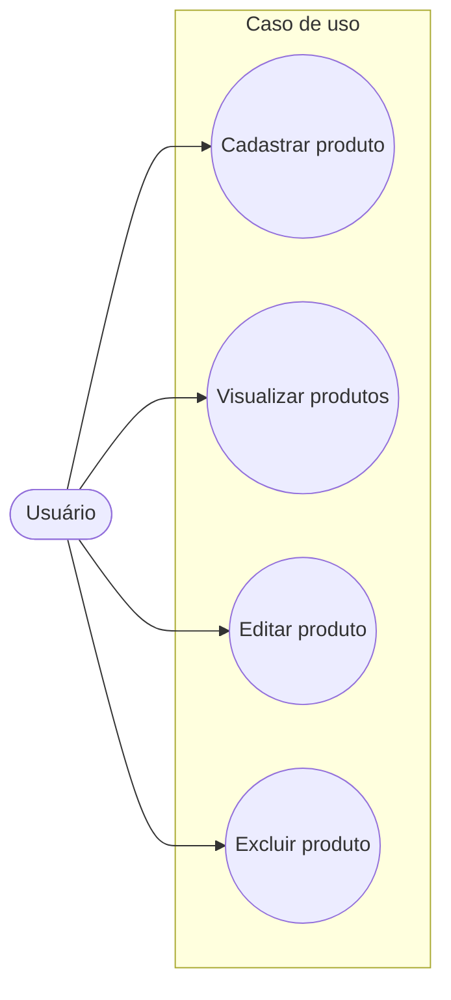

# Gestão de Estoque


O sistema de Gestão de Estoque foi desenvolvido para realizar o cadastro, visualização, edição e exclusão de produtos de um estoque.
O sistema permite controlar informações como nome, categoria, preço, quantidade disponível e data de validade dos produtos.

## Caso de uso

## Tecnologias utilizadas

* PHP
* MySQL
* HTML
* XAMPP

## Requisitos e instalação

Para executar o sistema é necessário ter:

* XAMPP instalado
* Apache ativo
* MySQL ativo


Instale e ative o apache e o mysql  do XAMPP no computador.

Copie a pasta do repositorio para:
```text
C:\xampp\htdocs\
```

Abra o phpMyAdmin pelo endereço:

```text
http://localhost/phpmyadmin
```
e execute o script sql do arquivo script.sql encontrado no repositorio

Com o Apache e o MySQL ativos, abra o navegador e acesse:

```text
http://localhost/gestao_estoque/
```

## Estrutura do banco de dados

O sistema utiliza o banco de dados `crud_estoque`, que possui a tabela `produtos`.

| Campo            | Tipo          | Descrição                        |
| ---------------- | ------------- | -------------------------------- |
| `id`             | INT           | Identificador único do produto   |
| `nome`           | VARCHAR(100)  | Nome do produto                  |
| `categoria`      | VARCHAR(100)  | Categoria do produto             |
| `preco`          | DECIMAL(10,2) | Preço do produto                 |
| `quantiaEstoque` | INT           | Quantidade disponível em estoque |
| `dataValidade`   | DATE          | Data de validade do produto      |


## Principais funcionalidades

Cadastro de produtos

Permite cadastrar novos produtos informando:

* Nome
* Categoria
* Preço
* Quantidade em estoque
* Data de validade

O sistema verifica se os campos obrigatórios foram preenchidos antes de realizar o cadastro.

Listagem de produtos

Os produtos cadastrados são exibidos em uma tabela, permitindo visualizar as informações armazenadas no banco de dados.

Edição de produtos

Permite selecionar um produto e alterar suas informações.

Exclusão de produtos

Permite remover produtos cadastrados no sistema.


